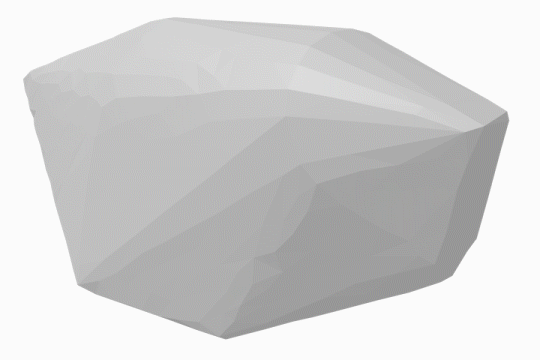

# Point2Mesh Reimplementation



This is a reimplementation of [Point2Mesh: A Self-Prior for Deformable Meshes](https://ranahanocka.github.io/point2mesh/) by Rana Hanocka, Gal Metzer, Raja Giryes and Daniel Cohen-Or. It was written by David Charatan, Solon James and Grace Deng as a final project for CSCI 1470: Deep Learning at Brown University. The authors' original implementation (in PyTorch) can be found [here](https://github.com/ranahanocka/Point2Mesh/).

## Running the Code

Several example point clouds can be found in the `data` folder. To fit to a point cloud, do the following:

```
python3 -m source.script_modules.train_model data/point_clouds/elephant_settings.json
```

Replace `elephant_settings.json` with a JSON settings file of your choice. For more information about valid JSON settings files, see `options.py`.

## Project Setup

### Creating a Virtual Environment

To create a virtual environment, run `python3 -m venv venv`. Then, do `source venv/bin/activate` (or equivalent) and `pip3 install -r requirements.txt` to install the project's dependencies.

### Manifold Software Dependency

The remeshing and simplification operations Point2Mesh depends on require [this watertight manifold software](https://github.com/hjwdzh/Manifold). To install it, `cd` into the `point2mesh-reimplementation` folder and run the following:

```
git clone --recursive -j8 git://github.com/hjwdzh/Manifold
cd Manifold
mkdir build
cd build
cmake .. -DCMAKE_BUILD_TYPE=Release
make
```

### Installing OpenEXR

OpenEXR, a dependency of TensorFlow Graphics, cannot be installed directly via `pip`. Instead, follow the steps below:

#### Windows

Download a precompiled wheel file from `https://www.lfd.uci.edu/~gohlke/pythonlibs/`, move it to the workspace folder, then run `python -m pip install SomePackage-1.0-py2.py3-none-any.whl`. Running `pip3 install tensorflow-graphics` should then work.

#### MacOS

```
brew install openexr
export CFLAGS="-I/Users/USERNAME/homebrew/include/OpenEXR -std=c++11"
export LDFLAGS="-L/Users/USERNAME/homebrew/lib"
pip3 install tensorflow-graphics
```

#### Ubuntu

```
sudo apt-get install python3-dev
sudo apt-get install libopenexr-dev
sudo apt-get install openexr
pip3 install tensorflow-graphics
```

### Running Scripts

The scripts in `script_modules` can be run as Python modules. To run `create_convex_hull.py`, run the command `python3 -m source.script_modules.create_convex_hull` from the project's root directory. Several VS Code run configurations are included in `.vscode/launch.json`.

### Running Unit Tests

To run the unit tests in VS Code, open the command menu (<kbd>⌘ Command</kbd> <kbd>⇧ Shift</kbd> <kbd>P</kbd> on MacOS) and run `Python: Discover Tests` and then `Python: Run All Tests`. I recommend discovering and running tests through Python Test Explorer for Visual Studio Code (`littlefoxteam.vscode-python-test-adapter`) if you add more tests, since it's hard to diagnose broken tests that aren't being discovered with the default test explorer.

### GCP VM Creation Steps

Disclaimer: This is a bit hacky since GCP's setup precludes usage of the normal venv setup.

First, make a VM:

- Region: `us-west1 (Oregon)`
- Series: `N1`
- Machine type: `n1-standard-4 (4 vCPU, 15 GB memory)`
- Under `CPU platform and GPU`: Add one `NVIDIA Tesla V100` GPU
- Scroll down and check `Allow HTTP traffic` and `Allow HTTPS traffic`
- Set the boot disk to `Deep Learning on Linux` and `Intel® optimized Deep Learning Image: TensorFlow 2.3 m59 (with Intel® MKL-DNN/MKL and CUDA 110)`.

Now, SSH into the VM under `Open in browser window`. You might have to wait a few minutes before this is possible (before that, it might hang). Now, in the terminal:

- When it prompts you for driver installation when you first log in, say yes.

Now run the following commands:

```
git clone https://github.com/dcharatan/point2mesh-reimplementation.git
cd point2mesh-reimplementation

git clone --recursive -j8 git://github.com/hjwdzh/Manifold
cd Manifold
mkdir build
cd build
cmake .. -DCMAKE_BUILD_TYPE=Release
make

cd ~/point2mesh-reimplementation
pip3 install trimesh
rm -rf /opt/conda/lib/python3.7/site-packages/cloudpickle
pip3 install cloudpickle==1.4.0
sudo apt-get install libopenexr-dev
sudo apt-get install openexr
pip3 install tensorflow-graphics
```

Now you can run the training script via:

```
python3 -m source.script_modules.train_model
```

### Retrieving OBJs from Google Cloud

```
mv results ~
zip -r temp.zip results
```

If using the browser-based SSH terminal, now click the cog (settings icon) and download `temp.zip`.

## Acknowledgements

The files `elephant.pwn`, `hand.pwn` and `sphere.pwn` were taken from Alex Jacobson's [mesh reconstruction project](https://github.com/alecjacobson/geometry-processing-mesh-reconstruction).
